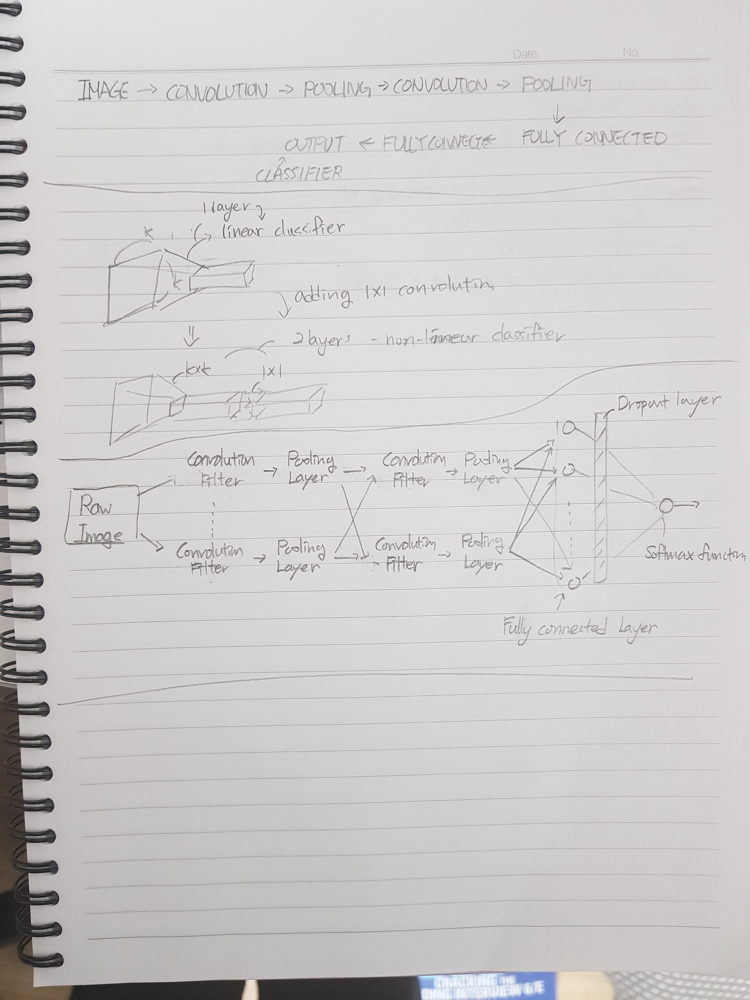

## Udacity Deep Learning Project write_up

### Fully Convolutional Network & fully connected network
Convolutional Network is useful for image classification. If I want to recognize an object I will use a fully connected layer with softmax activation. 
 However, If I need to recognize the object and know where it is. Due to the fact that Fully connected layer doesn't contain spacial data, Convolutional Network does because it makes a group with adjacent data(in image, pixels) treat them as a collective.
In CovNet, Encoder extracts features from the image, and Decoder up-sacles the output of the encoder that it's the same size as the original image. Furthermore, decoder add spacial information to encoded data.

### 1x1 convolution
1x1 convolution can reduce/increase filters. It is to generate a deeper network without simply stacking more layers. And also It is inexpensive. Due to smaller kernel size(1x1), it causes less over-fitting. It is also useful containing spacial information. replacing Fully Connected Layer with 1x1 Convolution Layers let results preserve spatial information.
Fully Connected Layer with same size returns same number of feature. However Convolution Layer could change dimensionality of the layer. sometimes It makes linear classification to non-linear. It will make much more accurate model.

References: 
http://iamaaditya.github.io/2016/03/one-by-one-convolution/
https://www.facebook.com/groups/TensorFlowKR/permalink/447826408891756 (Korean)

### Batch Size
I've used default images which is about 4000(4131 by 'ls | wc -l'), so I set 42 batches and 100 epochs.

### Number of Epochs
I’ve tried a number of epochs 70, 100, 120. I thought more epochs, more accuracy because 100 times looking big deal.
 However, I realized that after about 50~60. It looks over-fitting, didn’t reduce error and even increase.
 So this time, I set 50. Maybe next time, I would set much less number of epochs.

### batch size & steps per epoch
I've tried 20 batch size and 200 steps per epochs which result is great, and also changed my validation from 30 to 20 because of changing batch size.

### Further
I should've collected more datas to get more accurate model. If I have sufficient datas for train, validation. I believe that I would have models.

by comparing these iamges. tensorflow(or keras) makes a model. due to the fact that all datas I have got is for human. It won't follow dogs, cats, but with correct datas It will
